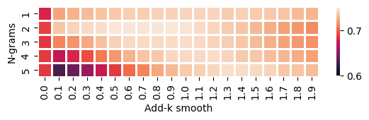

# CSE 842 Homework

## Question 1

### Command: 

```python liujia45_hw1p1.py```

### Results:

I have tried multiple settings of add-k-smoothing with 3-fold testing, and the test results are:

| Add-k-smooth | Precision | Recall | F1 | Accuracy |
| --- | --- | --- | --- | --- |
| 0(no smoothing) |  0.7060 | 0.7500 | 0.7270 | 0.7185 |
| 0.1 | 0.8048 | 0.7570 | 0.7797 | 0.7865 |
| **1** | 0.8097 | 0.7870 | 0.7977 | **0.8010** |

Then I chose 1 as the smooth parameter. Performance on the training set (add-1-smooth):

| Fold | Precision | Recall | F1 | Accuracy |
| --- | --- | --- | --- | --- |
| 1, 2 | 0.9970 | 0.9805 | 0.9887 | 0.9888 |
| 0, 2 | 0.9939 | 0.9790 | 0.9864 | 0.9865 |
| 0, 1 | 0.9879 | 0.9775 | 0.9826 | 0.9827 |

Performance on the testing set (add-1-smooth):

| Fold | Precision | Recall | F1 | Accuracy |
| --- | --- | --- | --- | --- |
| 0 | 0.7935 | 0.8078 | 0.8006 | 0.7988 |
| 1 | 0.8073 | 0.7297 | 0.7666 | 0.7778 |
| 2 | 0.8283 | 0.8234 | 0.8258 | 0.8263 |
| Avg | 0.8097 | 0.7870 | 0.7977 | 0.8010 |


## Question 2

### Command: 

```python liujia45_hw1p2_all.py```

### Results:

I explored the regularization parameter of Support Vector Machine on both BOW and TF-IDF:

| Model | Features | Precision | Recall | F1 | Accuracy |
| --- | --- | --- | --- | --- | --- |
| 1-Support Vector Machine | Bag-of-words | 0.7677 | 0.6405 | 0.6978 | 0.7230 |
| 2-Support Vector Machine | Bag-of-words | 0.7916 | 0.7011 | 0.7435 | 0.7580 |
| **3-Support Vector Machine** | Bag-of-words | 0.8171 | 0.7283 | 0.7701 | **0.7825** |

| Model | Features | Precision | Recall | F1 | Accuracy |
| --- | --- | --- | --- | --- | --- |
| 1-Support Vector Machine | TF-IDF | 0.8215 | 0.8232 | 0.8223 | 0.8220 |
| **2-Support Vector Machine** | TF-IDF | 0.8385 | 0.8412 | 0.8398 | **0.8395** |
| 3-Support Vector Machine | TF-IDF | 0.8368 | 0.8412 | 0.8390 | 0.8385 |

I have tested the BOW and TF-IDF encoder on both add-1-smoothing NB and SVM. And did 3-fold testing, which results are:

| Model | Features | Precision | Recall | F1 | Accuracy |
| --- | --- | --- | --- | --- | --- |
| Naive Bayes | Bag-of-words| 0.8116 | 0.7964 | 0.8039 | 0.8055 |
| Naive Bayes | TF-IDF| 0.8581 | 0.7224 | 0.7758 | 0.7965 |
| 3-Support Vector Machine | Bag-of-words | 0.8171 | 0.7283 | 0.7701 | 0.7825 |
| **2-Support Vector Machine** | TF-IDF | 0.8385 | 0.8412 | 0.8398 | **0.8395** |

We can observe that TF-IDF is not worked for NB. When using BOW, SVM worked even worse than NB, but outperformed others when using the TF-IDF encoder.


## Question 1 ex

### Command: 

```python liujia45_hw1p1_ex.py --n-grams {$N_GRAMS} --k-smooth {$K_SMOOTH}```

### Results:

I downloaded the [Sarcasm V2.0 Corpus](https://nlds.soe.ucsc.edu/sarcasm2) to test the Naive Bayes model's handling sarcasm performance. To improve the performance of NB, I explored the `k` of Laplacian Smoothing.
 
| Add-k-smooth | Precision | Recall | F1 | Accuracy |
| --- | --- | --- | --- | --- |
 | 0.0 (baseline) | 0.6889 | 0.6595 | 0.6738 | 0.6808 | 
 | 0.2 | 0.7280 | 0.7281 | 0.7280 | 0.7280 | 
 | 0.4 | 0.7384 | 0.7260 | 0.7321 | 0.7344 | 
 | 0.6 | 0.7478 | 0.7194 | 0.7333 | 0.7383 | 
 | 0.8 | 0.7577 | 0.7066 | 0.7312 | 0.7403 | 
 | **1.0** | 0.7655 | 0.6947 | 0.7283 | **0.7409** | 
 | 1.2 | 0.7736 | 0.6806 | 0.7241 | 0.7407 | 
 | 1.4 | 0.7804 | 0.6655 | 0.7184 | 0.7391 | 
 | 1.6 | 0.7864 | 0.6480 | 0.7105 | 0.7360 | 
 | 1.8 | 0.7919 | 0.6284 | 0.7007 | 0.7316 | 

 Then, since negated meanings could be expressed in multiple words, I implemented the n-gram model. Then did an exploration among the gram numbers (without smoothing).

| N-grams | Precision | Recall | F1 | Accuracy |
| --- | --- | --- | --- | --- |
 | 1 (baseline) | 0.6889 | 0.6595 | 0.6738 | 0.6808 | 
 | **2** | 0.7340 | 0.5979 | 0.6590 | **0.6906** | 
 | 3 | 0.7312 | 0.5915 | 0.6539 | 0.6870 | 
 | 4 | 0.7212 | 0.6133 | 0.6628 | 0.6880 | 
 | 5 | 0.7045 | 0.6450 | 0.6734 | 0.6872 |

Then we can do a grid search among the `k` and `n`:



Therefore, we can find the highest accuracy. Compared with the baseline:

| Models | Precision | Recall | F1 | Accuracy |
| --- | --- | --- | --- | --- |
| Baseline (1-gram, no smoothing) | 0.6889 | 0.6595 | 0.6738 | 0.6808 |
| Optimized (2-gram, add-0.8 smoothing) | 0.7816 | 0.6891 | 0.7324 | **0.7482** |


## Optional Arguments
```sh
optional arguments:
  -h, --help            show this help message and exit
  --seed SEED           Random seed. (default: 2)
  --data-dir DATA_DIR   Path to save datasets. (default: ./data)
  --n-folds N_FOLDS     Numbers of folds in testing. (default: 3)
  --n-grams N_GRAMS     Numbers of grams in encoding. (default: 1)
  --testing-fold TESTING_FOLD
                        The index of which fold should be in the 
                        testing set. (default: Enumerate all folds)
  --k-smooth K_SMOOTH   Value of add-k-smoothing in Naive Bayes. (default: 1)
  --C-SVC C_SVC         Value of regularization parameter in Support
                        Vector Machine. (default: 1)
  --save-dir SAVE_DIR   Directory to save models. Only for handcraft 
                        NB model. (default: ./model)
  --checkpoint-path CHECKPOINT_PATH
                        Path to load pre-trained model. (default: None)
```